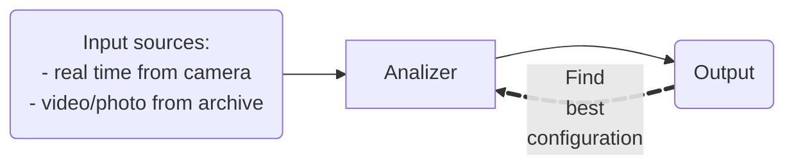

# Bike Fitting
<p align="center">
   
</p>

## Main purpose

The focus of this APP is to analyze my road bike position and give me overall angles, display them, and get some suggestions to improve the entire fit.
Beside that, i found very interesting to use ML model identify all body joints. 
For this purpose i've chosen [Mediapipe](https://ai.google.dev/edge/mediapipe/solutions/guide), which share a high performance ML image processing model
[Pose landmark detection](https://ai.google.dev/edge/mediapipe/solutions/vision/pose_landmarker) suitable for native Android application.
However all samples are in the old fashionable Android app structure (with Activities and xml), so i adapt them for [Jetpack Composable](https://developer.android.com/compose) structure.

## Project structure



### Input sources

As you can see in the scheme above the input sources can be of two types and now i show you a little bit how i acquire them.

#### Real time stream
By mean of [CameraX](https://developer.android.com/media/camera/camerax) library i got access to the device camera and to analyze frame by frame.
All you need are:
- configure cameraProvider
```
//State definition
val cameraProvider= remember { mutableStateOf<ProcessCameraProvider?>(null) }

//Init camera provider
LaunchedEffect(Unit) {
  cameraProvider.value = ProcessCameraProvider.awaitInstance(context)
  ...
}
```
-  cameraSelector where to define front or rear camera
```
val cameraSelector = CameraSelector.Builder()
            .requireLensFacing(cameraSelectorType)
            .build()
```

- define the analyzer to analyze every single frame
```
//Configure analyzer
val imageAnalysis = ImageAnalysis.Builder()
    .setBackpressureStrategy(ImageAnalysis.STRATEGY_KEEP_ONLY_LATEST)
    .build()
    
//Executor used for data analysis
val executor = Executors.newSingleThreadExecutor()

imageAnalysis.setAnalyzer(executor, { imageProxy ->
    ...here make analysis...
})
```

- the last step is to connect these entities all together
```
  val camera = cameraProvider.value?.bindToLifecycle(
  context as LifecycleOwner,
  cameraSelector,
  imageAnalysis
  )
  ```
Now from the analyzer you have access to a frame like a imageProxy.  

#### Select photo or video from archive
In the case you have to analyze a resource (video/photo) from storage, the best approach is to use the 
default [Photo picker](https://developer.android.com/training/data-storage/shared/photopicker#compose).
This provide the built in interface to select and get photo or video uri, without permissions.

```
 // Registers a photo picker activity launcher in single-select mode.
val pickMedia = rememberLauncherForActivityResult(ActivityResultContracts.PickVisualMedia()) { uri ->
    // Callback is invoked after the user selects a media item or closes the photo picker.
    if (uri != null) {
        ...make action with this uri...
    }
}

// Launch the photo picker for video.
pickMedia.launch(PickVisualMediaRequest(ActivityResultContracts.PickVisualMedia.VideoOnly))

// Launch the photo picker for image.
pickMedia.launch(PickVisualMediaRequest(ActivityResultContracts.PickVisualMedia.ImageOnly))
```

### Analysis in deep
To get the interested landmarks from the input, 
[Mediapipe pose landmark detection for Android](https://ai.google.dev/edge/mediapipe/solutions/vision/pose_landmarker/android) has been used.
I've found them ideal for the task of landmarks detection, because the model run into de device and this reduce the latency of the result.
Once the points have been found, with al little bit of trigonometric i computed the angle between them for further analysis. 

In particular, this library present a class that initialize a ML model to detect all landmarks.
To avoid the initialization of this class every time a frame / video or photo need to be analyzed, i've used a @Module
to control and optimize the lifecycle of this instance.
For this case i defined the module @InstallIn(ViewModelComponent::class) to create and destroy only one instance
according with ViewModel lifecycle:
```
@Module
@InstallIn(ViewModelComponent::class)
object HelperModule {

    @Provides
    fun providePoseLandmarks(@ApplicationContext context: Context): PoseLandmarkerHelper{
        return PoseLandmarkerHelper(context = context)
    }
}
```

Once the instance has been created and the uri or a imageProxy has been obtained, we can apply these
methods came from PoseLandmarkerHelper.kt instance:
- detectLiveStream
- detectVideoFile
- detectImage

### Output details
- All pose landmarks, angle and threshold has been displayed on image (came from video or live streaming). This is achieved by mean of
  [Canvas](https://developer.android.com/develop/ui/compose/graphics/draw/overview#common-drawing) functionalities.

- In video analysis, a chart representation display how every angle evolve over the time. Furthermore above every chart you can notice a "score" label.
This score gives an indication of how many samples (in percentage over the total) the angle is inside the threshold.

### Simulate saddle shift
Once all landmarks have been found, i tried to simulate the saddle shift (up, down, left and right).
This simulation has been achieved basically moving hips coordinates in the four directions
maintaining fixed the length os others body a arts and intersect them to find the new point.
The new position has been identified by dashed line.

### Find best configuration
Based on score indicator (explained above), I've tried to find the best position in terms of saddle height and saddle shift, to
maximize all the scores.
Basically, saddle shift has been simulated like a hips movement up, down, left, right, maintaining the length of the body parts. 
After that, multiple overall video analysis has been performed and the new scores has been evaluated. 
When no more improvements of scores has been evaluate then this is the best configuration.

## Results


## Final considerations
Mediapipe provide a good solution to run ML model on Android device using Jetpack Compose App.

Using ML model inside the device, the latency of detection is minimal and this is suitable for real time applications.


